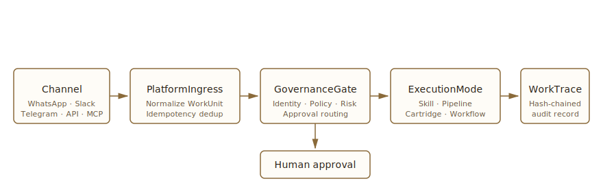

# Switchboard

> **Governed operating system for revenue actions.**

Switchboard runs the operations side of a business through one control plane. Every revenue action — answering an inbound lead, optimizing ad spend, producing a creative — flows through the same governance, audit trail, idempotency, and human-override paths. One platform, three revenue wedges, one source of truth.

---

## Three Revenue Wedges

| Wedge | Status | What it does |
|---|---|---|
| **Lead-to-Booking (Alex)** | `Alpha` | WhatsApp-native conversion agent. Inbound lead → governed qualification → Google Calendar booking. Actively under hardening; not yet shipped. |
| **Ad Optimization** | `Production-grade` | Meta + Google integrations. Lead ingestion, funnel and saturation analysis, automated budget and creative recommendations — all routed through governance. |
| **Product / Character / Director (PCD)** | `Planned` | Character-consistent creative across Sora, Veo, Runway, Kling, and HeyGen. Currently developed in a separate repo ([`creativeagent`](https://github.com/jsonljc/creativeagent)); integration into Switchboard targeted for a later release. |

Status labels describe code maturity, not deployment status. We do not claim a wedge is "live" unless it is.

---

## Why Switchboard Outperforms Human Operators

These are properties of the architecture, not marketing. Each one ties back to a real component in the codebase.

- **24/7 sub-second response.** Channel adapters answer inbound traffic in seconds. A human inbox answers in hours, and decay curves on conversion are steep.
- **Nothing slips through the cracks.** Every action becomes a `WorkUnit` and is persisted in `WorkTrace` (`packages/core/src/platform/work-trace.ts`). No forgotten follow-ups, no "I missed that DM."
- **Consistent judgment at scale.** `GovernanceGate.evaluate()` (`packages/core/src/platform/governance/governance-gate.ts`) applies the same identity, policy, and risk evaluation to action #1 and action #10,000. Humans drift, get tired, and apply rules unevenly.
- **Parallel wedges, one operator.** One platform runs lead-to-booking, ad optimization, and (soon) creative production at the same time. A human team needs three specialists plus a coordinator.
- **A learning loop that compounds.** Every decision is hashed, anchored to an audit entry, and outcome-linked (`work-trace-integrity.ts`). Policy changes are evaluated against history. Tribal knowledge does not walk out the door.
- **Compliance built in.** Tamper-evident audit trail (SHA-256 content hash + audit-anchor binding) and first-class human-override paths (`packages/core/src/approval/lifecycle-service.ts`) mean speed *without* losing accountability. Most "AI agents" trade one for the other.
- **Fixed-cost economics.** Marginal cost per action approaches zero; headcount cost scales linearly with volume. A switchboard that handles 10× the volume next quarter does not need 10× the budget.

---

## How It Works



```
Channel (Telegram / WhatsApp / Slack / API / MCP)
    │
    ▼
DeploymentResolver  →  resolve org + skill + trust context
    │
    ▼
PlatformIngress.submit()  →  normalize WorkUnit, enforce idempotency
    │
    ▼
┌─────────────────────────────────┐
│  GovernanceGate.evaluate()      │
│  ├ Identity resolution          │
│  ├ Policy evaluation            │
│  ├ Risk scoring                 │
│  └ Approval routing             │
└────────────┬────────────────────┘
             │
       ┌─────┴─────┐
       ▼           ▼
    EXECUTE    REQUIRE APPROVAL
       │           │
       │     Human reviews
       │     (approve / reject → trust score update)
       │
       ▼
ExecutionMode dispatches work
  ├ SkillMode    — LLM tool-calling with auditable tools
  ├ PipelineMode — async jobs via Inngest
  └ CartridgeMode — legacy deterministic (bridge only)
       │
       ▼
WorkTrace persisted  →  canonical lifecycle record
```

### What's Live Today

- **Ad Optimization:** Meta CAPI + Google Offline Conversions integration is real and shipping data. Funnel analysis, saturation detection, and Inngest-driven daily/weekly audits are wired and running.
- **Alex (Lead-to-Booking):** WhatsApp ingress, governance gating, and the calendar-booking tool are all wired end-to-end. The skill is in alpha — three known launch blockers are tracked in `.audit/` and being worked off before we promote it to production.
- **PCD (Creative Studio):** Lives in [`creativeagent`](https://github.com/jsonljc/creativeagent) today. Switchboard's `packages/creative-pipeline` carries UGC scaffolding (Kling provider, scripting, scene casting, realism QA) for the future integration.

For deeper architecture: [`docs/DOCTRINE.md`](docs/DOCTRINE.md), [`docs/ARCHITECTURE.md`](docs/ARCHITECTURE.md).

---

## For Contributors

Switchboard is a TypeScript monorepo (pnpm workspaces, Turborepo). The codebase is organized by dependency layer; circular dependencies are forbidden.

### Project Structure

```
packages/
├── schemas/            # Zod schemas & shared types (no internal deps)
├── sdk/                # Agent manifest, handler interface, test harness
├── cartridge-sdk/      # Legacy cartridge interface (bridge only)
├── creative-pipeline/  # Creative content pipeline (async jobs via Inngest)
├── ad-optimizer/       # Ad platform integration + optimization
├── core/               # Platform ingress, governance, skill runtime, orchestration
└── db/                 # Prisma ORM, store implementations, credential encryption

apps/
├── api/          # Fastify REST API — platform ingress + governance (port 3000)
├── chat/         # Multi-channel chat — Telegram, WhatsApp, Slack (port 3001)
├── dashboard/    # Next.js operator UI + deployment controls (port 3002)
└── mcp-server/   # MCP server for LLM tool use
```

### Dependency Layers

```
Layer 1: schemas                                              → no internal deps
Layer 2: sdk, cartridge-sdk, creative-pipeline, ad-optimizer  → schemas only
Layer 3: core                                                 → schemas + sdk + cartridge-sdk
Layer 4: db                                                   → schemas + core
Layer 5: apps/*                                               → may import anything
```

### Quick Start

#### Prerequisites

- Node.js 20+
- [pnpm](https://pnpm.io/) 9.x
- **PostgreSQL 17 or 18** (the schema uses the `vector` extension, which Homebrew's `pgvector` formula only ships for these versions)
- **pgvector** extension for Postgres
- Redis (optional — dedup, rate-limiting, and BullMQ fall back to in-memory if absent)

On macOS:

```bash
brew install postgresql@17 pgvector
brew services start postgresql@17
createuser -s switchboard
createdb -O switchboard switchboard
psql -d switchboard -c "ALTER USER switchboard WITH PASSWORD 'switchboard';"
```

#### Setup

```bash
git clone https://github.com/jsonljc/switchboard.git
cd switchboard
pnpm install
./scripts/setup-env.sh                        # generates secrets into .env AND apps/dashboard/.env.local
pnpm db:migrate                                # apply Prisma migrations
pnpm db:seed                                   # seed admin@switchboard.local / admin123
pnpm build
```

#### Development

```bash
pnpm dev                                      # all services in watch mode

pnpm --filter @switchboard/api dev            # http://localhost:3000
pnpm --filter @switchboard/dashboard dev      # http://localhost:3002
pnpm --filter @switchboard/chat dev           # http://localhost:3001 (requires a channel token, see below)
```

`apps/chat` warns (and starts with no inbound channels) when none of `TELEGRAM_BOT_TOKEN`, `WHATSAPP_TOKEN` + `WHATSAPP_PHONE_NUMBER_ID`, or `SLACK_BOT_TOKEN` is set in development; in production, the same condition is a hard error. Configure at least one channel token to actually receive messages.

#### Working with the database

Edits to `packages/db/prisma/schema.prisma` must be paired with a migration in the same commit.

```bash
pnpm --filter @switchboard/db exec prisma migrate dev --name <descriptive-name>
git add packages/db/prisma/migrations/
```

`pnpm db:check-drift` runs the same validation locally (requires a running PostgreSQL — Prisma uses a shadow database to compare migrations against the schema). CI runs it on every PR and blocks merges when drift is detected.

#### Docker

```bash
cp .env.example .env
docker compose up

# Individual targets
docker build --target api -t switchboard-api .
docker build --target chat -t switchboard-chat .
docker build --target mcp-server -t switchboard-mcp .
docker build --target dashboard -t switchboard-dashboard .
```

### Testing

```bash
pnpm test                                    # all tests
pnpm --filter @switchboard/core test         # core + governance
pnpm --filter @switchboard/api test          # API routes
pnpm test -- --coverage                      # with coverage
```

---

## Docs & Further Reading

- [`docs/DOCTRINE.md`](docs/DOCTRINE.md) — architectural rules and invariants
- [`docs/ARCHITECTURE.md`](docs/ARCHITECTURE.md) — deep architectural reference
- [`docs/OPERATIONS.md`](docs/OPERATIONS.md) — runbook for operators
- [`docs/DEPLOYMENT-CHECKLIST.md`](docs/DEPLOYMENT-CHECKLIST.md) — production deploy checklist
- [`creativeagent`](https://github.com/jsonljc/creativeagent) — separate repo for the PCD wedge (will be integrated)

---

## API

### Governed Execution (`/api/execute`, `/api/actions`)

All business actions enter through `PlatformIngress`. Requires the `Idempotency-Key` header.

### Governance (`/api/approvals`, `/api/policies`, `/api/identity`, `/api/audit`)

Approval workflows, policy management, identity resolution, and the tamper-evident audit trail.

### Skills & Deployment (`/api/marketplace`)

Skill registration and deployment surfaces. Execution and governance state. Provisioning and runtime management.

See Swagger UI at `/docs` for full endpoint documentation.

---

## Environment Variables

See [`.env.example`](.env.example) for all available options. Never commit `.env` files or secrets.

---

## License

MIT
