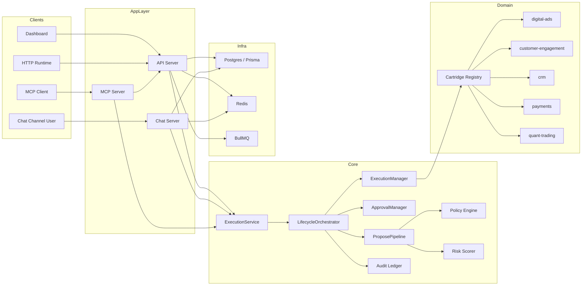

# Switchboard Full Capability Spec

## Status

This document is a code-derived specification of the current implementation in the repository as of March 9, 2026. It is based on the wired runtime paths in:

- `apps/api`
- `apps/dashboard`
- `apps/chat`
- `apps/mcp-server`
- `packages/core`
- `packages/schemas`
- `packages/db`
- `cartridges/*`

It is not a product vision document. It describes what the repository currently implements, what is partially wired, and where important seams exist.

## 1. System Overview

Switchboard is a governed action-execution platform for AI operators and agent runtimes.

At a high level, the system does the following:

1. Accepts a requested action from an agent, runtime, chat workflow, dashboard user, or API client.
2. Resolves the correct cartridge and optional referenced entities.
3. Enriches the action context with cartridge-specific data.
4. Scores risk and evaluates governance rules.
5. Either denies the action, routes it for approval, or auto-approves it.
6. Executes the action through a cartridge.
7. Stores execution metadata, undo information when available, and audit evidence.
8. Exposes operational views through the dashboard, chat, MCP, reports, and monitoring APIs.

Core product themes implemented in code:

- Governed execution
- Approval routing
- Risk scoring
- Policy evaluation
- Auditability
- Undo requests
- Multi-surface runtime access
- Organization-scoped configuration
- Background automation
- Domain expansion through cartridges

## 2. Repository Architecture

### 2.1 Workspace Structure

- `apps/api`: Fastify API server and background job bootstrap
- `apps/dashboard`: Next.js operator dashboard
- `apps/chat`: Fastify webhook/chat runtime
- `apps/mcp-server`: MCP server for governed tool access
- `packages/core`: orchestration, governance, policy, audit, runtime adapters, agents
- `packages/schemas`: Zod contracts and shared domain types
- `packages/db`: Prisma schema and DB-backed store implementations
- `packages/cartridge-sdk`: cartridge interface and helpers
- `cartridges/*`: domain-specific action providers
- `skins/*`: industry/runtime tool filtering and language/governance presets
- `profiles/*`: demo business profiles for profile-aware agent contexts

### 2.2 Runtime Topology

## 3. Core Execution Model

### 3.1 Main Classes

- `ExecutionService`
  - single facade for propose plus conditional execute
  - used by `/api/execute`
  - used by runtime adapters
  - used by MCP mutation tools

- `LifecycleOrchestrator`
  - top-level coordinator
  - delegates to:
    - `ProposePipeline`
    - `ApprovalManager`
    - `ExecutionManager`

- `PolicyEngine`
  - applies governance checks and policy effects

- `AuditLedger`
  - writes tamper-evident hash-chained records

### 3.2 Execution Outcomes

The system normalizes side-effectful execution into:

- `EXECUTED`
- `PENDING_APPROVAL`
- `DENIED`

This contract is shared across:

- REST `/api/execute`
- MCP tools
- OpenClaw adapter
- chat API-backed orchestration mode

### 3.3 Request Lifecycle

1. Receive action request
2. Infer `cartridgeId` from `actionType`
3. Resolve entity references if present
4. Load identity and org context
5. Enrich action parameters via cartridge
6. Evaluate guardrails
7. Evaluate spend constraints
8. Evaluate policy rules
9. Compute risk category and approval requirement
10. Create envelope
11. Deny, queue approval, or execute
12. Record audit/activity

### 3.4 Approval Model

Approval requests contain:

- request summary
- risk category
- approvers
- binding hash
- expiry timestamp

Supported approval actions:

- approve
- reject
- patch

Approval integrity controls:

- versioned approval state
- binding hash validation
- stale version detection
- optional self-approval restriction
- approval response rate limit support in orchestrator config

### 3.5 Undo Model

Executed actions may store undo recipes.

Undo flow:

1. Request undo on prior envelope
2. Orchestrator creates a reverse proposal
3. Reverse action goes through governance again
4. Undo may still be denied or require approval

## 4. Governance Engine

### 4.1 Identity Model

Identity spec fields:

- `principalId`
- `organizationId`
- `name`
- `description`
- `riskTolerance` by risk category
- `globalSpendLimits`
- `cartridgeSpendLimits`
- `forbiddenBehaviors`
- `trustBehaviors`
- `governanceProfile`
- `delegatedApprovers`

Role overlays can modify identity behavior under conditions.

### 4.2 Governance Profiles

Implemented profiles:

- `observe`
- `guarded`
- `strict`
- `locked`

Observed semantics in code:

- `locked`: hard stop / most restrictive
- `strict`: higher-friction governance
- `guarded`: default supervised mode
- `observe`: more auto-approval behavior, including SMB auto-approval and progressive autonomy paths

### 4.3 Policy Engine Checks

The policy engine currently performs these check families:

- forbidden behavior
- trusted behavior
- competence trust/escalation annotations
- rate limits
- cooldowns
- protected entities
- spend limits
- policy rule evaluation
- approval requirement derivation
- risk category override support

### 4.4 Policy Language

Policies support:

- nested rule trees
- compositions `AND`, `OR`, `NOT`
- field-level operators:
  - `eq`
  - `neq`
  - `gt`
  - `gte`
  - `lt`
  - `lte`
  - `in`
  - `not_in`
  - `contains`
  - `not_contains`
  - `matches`
  - `exists`
  - `not_exists`

Effects:

- `allow`
- `deny`
- `modify`
- `require_approval`

### 4.5 SMB Pipeline

There is a distinct SMB governance path in `packages/core/src/smb`.

Differences from the full enterprise path:

- simplified evaluation model
- single-approver path
- SMB activity log instead of full audit-first query path for some operations
- explicit org tiering
- upgrade path from `smb` to `enterprise`

## 5. Security Model

### 5.1 API Authentication

API auth supports:

- static env-backed bearer keys
- DB-backed dashboard-generated keys
- optional key metadata:
  - `organizationId`
  - `runtimeId`
  - `principalId`

Excluded auth paths:

- `/health`
- `/metrics`
- `/docs`

### 5.2 Org Isolation

Most API surfaces apply one of:

- org ID derived from auth context
- explicit org access check against requested resource
- hard fail when org scope is missing

### 5.3 Credential Storage

Connections use encrypted credentials.

Requirements:

- `DATABASE_URL` must be configured for persisted connections
- `CREDENTIALS_ENCRYPTION_KEY` is required for encrypted credential operations

### 5.4 Replay and Duplicate Protection

- API-level idempotency cache via `Idempotency-Key`
- chat ingress nonce deduplication
- MCP duplicate mutation window
- optional orchestrator-level idempotency guard support

### 5.5 Webhook Verification

Implemented verification paths include:

- Telegram secret token
- Slack signing secret
- WhatsApp signature and challenge verification
- Stripe signature
- Twilio signature
- Facebook form verification challenge/signature

## 6. Persistence Model

### 6.1 Governance Tables

- `Principal`
- `DelegationRule`
- `IdentitySpec`
- `RoleOverlay`
- `Policy`
- `ActionEnvelope`
- `ApprovalRecord`
- `AuditEntry`

### 6.2 Runtime and Infra Tables

- `Connection`
- `IdempotencyRecord`
- `ProcessedMessage`
- `ManagedChannel`
- `FailedMessage`

### 6.3 Business and Operations Tables

- `OrganizationConfig`
- `AgentRoster`
- `AgentState`
- `SmbActivityLogEntry`
- `CrmContact`
- `CrmDeal`
- `CrmActivity`
- `AlertRule`
- `AlertHistory`
- `ScheduledReport`
- `AdsOperatorConfig`
- `CadenceInstance`
- `CompetenceRecord`
- `CompetencePolicy`
- `SystemRiskPosture`
- `ConversationState`

### 6.4 Dashboard Auth Tables

- `DashboardUser`
- `DashboardSession`
- `DashboardVerificationToken`

## 7. API Server Spec

### 7.1 Platform Concerns

Implemented at app boot:

- Helmet headers
- CORS
- rate limiting
- OpenAPI generation
- Swagger UI outside production or when enabled
- global structured error handling
- Prometheus metrics wiring
- OpenTelemetry initialization

### 7.2 Route Groups

The API registers these route groups:

- actions
- execute
- approvals
- policies
- audit
- identity
- simulate
- health
- interpreters
- cartridges
- connections
- organizations
- dlq
- token-usage
- alerts
- scheduled-reports
- crm
- competence
- webhooks
- inbound-webhooks
- inbound-messages
- smb
- governance
- campaigns
- reports
- conversations
- agents
- operator-config

### 7.3 Actions and Execution

#### `/api/execute`

Purpose:

- single choke point for governed execution

Requirements:

- POST only
- `Idempotency-Key` header required

Returns:

- `EXECUTED`
- `PENDING_APPROVAL`
- `DENIED`
- `422 needs_clarification`
- `404 not_found`

#### `/api/actions`

Endpoints:

- `POST /propose`
- `POST /batch`
- `GET /:id`
- `POST /:id/execute`
- `POST /:id/undo`

Capabilities:

- explicit propose without immediate execute
- batch propose multiple actions
- get envelope detail
- execute pre-approved envelope
- request undo

### 7.4 Approvals

Endpoints:

- `POST /api/approvals/:id/respond`
- `GET /api/approvals/pending`
- `POST /api/approvals/:id/remind`
- `GET /api/approvals/:id`

Capabilities:

- approve/reject/patch
- list pending approvals
- re-notify approvers
- inspect approval state

### 7.5 Identity

Endpoints:

- `POST /api/identity/specs`
- `GET /api/identity/specs/:id`
- `GET /api/identity/specs/by-principal/:principalId`
- `PUT /api/identity/specs/:id`
- `POST /api/identity/overlays`
- `GET /api/identity/overlays?specId=...`
- `PUT /api/identity/overlays/:id`

Capabilities:

- create and mutate identity specs
- create and mutate role overlays
- look up identity by principal

### 7.6 Policies

Endpoints:

- `GET /api/policies`
- `POST /api/policies`
- `GET /api/policies/:id`
- `PUT /api/policies/:id`
- `DELETE /api/policies/:id`

Capabilities:

- list by org and optional cartridge
- create/update/delete policies
- invalidate policy cache
- record policy audit events

### 7.7 Audit

Endpoints:

- `GET /api/audit`
- `GET /api/audit/verify`
- `GET /api/audit/:id`

Capabilities:

- filtered ledger queries
- deep and shallow chain verification
- single entry lookup

### 7.8 Health

Endpoints:

- `GET /api/health/deep`
- `GET /api/health/cartridges`

Capabilities:

- DB health
- Redis health
- queue depth
- worker state
- per-cartridge connection health

### 7.9 Organizations

Endpoints:

- `GET /api/organizations/:orgId/config`
- `PUT /api/organizations/:orgId/config`
- `GET /api/organizations/:orgId/integration`
- `POST /api/organizations/:orgId/provision`
- `DELETE /api/organizations/:orgId/channels/:channelId`
- `GET /api/organizations/:orgId/channels`
- `POST /api/organizations/:orgId/handoff`

Capabilities:

- org config CRUD
- integration guide generation for runtime types
- managed channel provisioning
- managed channel deletion and listing
- post-onboarding handoff and strategist kickoff

### 7.10 Connections

Endpoints:

- `POST /api/connections`
- `GET /api/connections`
- `GET /api/connections/:id`
- `PUT /api/connections/:id`
- `DELETE /api/connections/:id`
- `POST /api/connections/:id/test`

Capabilities:

- org-scoped connection storage
- encrypted credential management
- basic cartridge-linked connection health testing

### 7.11 Governance

Endpoints:

- `GET /api/governance/:orgId/status`
- `PUT /api/governance/:orgId/profile`
- `POST /api/governance/emergency-halt`

Capabilities:

- inspect org governance posture
- set org governance profile
- emergency lock plus campaign pause attempt

### 7.12 Competence

Endpoints:

- `GET /api/competence/records`
- `GET /api/competence/records/:principalId/:actionType`
- `GET /api/competence/policies`
- `POST /api/competence/policies`
- `PUT /api/competence/policies/:id`
- `DELETE /api/competence/policies/:id`

Capabilities:

- view competence history
- manage competence policies

### 7.13 Agents and Operator Config

#### `/api/agents`

Endpoints:

- `GET /roster`
- `PUT /roster/:id`
- `GET /state`
- `POST /roster/initialize`

Capabilities:

- initialize default team
- rename/reconfigure agents
- derive agent activity from audit events

#### `/api/operator-config`

Endpoints:

- `POST /`
- `GET /:orgId`
- `PUT /:orgId`
- `GET /:orgId/autonomy`

Capabilities:

- create/update ads operator config
- autonomy assessment based on competence aggregation

### 7.14 CRM and Conversations

#### `/api/crm`

Endpoints:

- `GET /contacts`
- `GET /contacts/:id`
- `GET /deals`
- `GET /deals/:id`
- `GET /activities`
- `GET /pipeline-status`

#### `/api/conversations`

Endpoints:

- `GET /`
- `GET /:id`
- `PATCH /:id/override`

Capabilities:

- list conversations by status/channel/principal
- fetch conversation transcript payload
- toggle human override

### 7.15 Campaigns and Reports

#### `/api/campaigns`

Endpoints:

- `GET /:id`
- `GET /search`

Capabilities:

- org-scoped campaign read through Meta-context provider

#### `/api/reports`

Endpoints:

- `GET /operator-summary`
- `GET /clinic`

Capabilities:

- combined spend/outcome/operator summary
- clinic-specific lead, booking, response-time, and attribution reporting

### 7.16 Alerts and Scheduled Reports

#### `/api/alerts`

Endpoints:

- `GET /`
- `POST /`
- `PUT /:id`
- `DELETE /:id`
- `POST /:id/test`
- `GET /:id/history`
- `POST /:id/snooze`

Capabilities:

- alert rule CRUD
- governed dry-run against diagnostics
- history tracking
- snoozing

#### `/api/scheduled-reports`

Endpoints:

- `GET /`
- `POST /`
- `PUT /:id`
- `DELETE /:id`
- `POST /:id/run`

Capabilities:

- scheduled report CRUD
- manual trigger of governed diagnostic action
- next-run timestamp calculation

### 7.17 Token Usage

Endpoints:

- `GET /api/token-usage`
- `GET /api/token-usage/trend`
- `GET /api/token-usage/models`

Capabilities:

- org-level prompt/completion token aggregation
- cost estimation
- daily trend
- model cost lookup

### 7.18 Webhooks and Inbound Message Ingestion

#### Outbound webhook registration

Endpoints:

- `GET /api/webhooks`
- `POST /api/webhooks`
- `DELETE /api/webhooks/:id`
- `POST /api/webhooks/:id/test`

Note:

- currently stored in-memory, not persisted

#### Inbound webhooks

Endpoints:

- `POST /api/inbound/stripe`
- `POST /api/inbound/forms`
- `GET /api/inbound/forms/verify`

Capabilities:

- Stripe event intake
- lead form intake
- Facebook verification support

#### Inbound messages

Endpoints:

- `POST /api/messages/sms`
- `POST /api/messages/chat`
- `POST /api/messages/status`

Capabilities:

- Twilio SMS ingress
- web chat ingress
- Twilio delivery callbacks

### 7.19 SMB Tier

Endpoints:

- `GET /api/smb/:orgId/activity-log`
- `GET /api/smb/:orgId/tier`
- `PUT /api/smb/:orgId/tier`
- `POST /api/smb/:orgId/upgrade`

Capabilities:

- SMB activity inspection
- SMB config management
- upgrade to enterprise tier

### 7.20 Interpreters

Endpoints:

- `GET /api/interpreters`
- `POST /api/interpreters`
- `POST /api/interpreters/:name/enable`
- `POST /api/interpreters/:name/disable`
- `GET /api/interpreters/routing`
- `POST /api/interpreters/routing`
- `DELETE /api/interpreters/routing/:organizationId`

Note:

- configuration is API-memory only today

### 7.21 DLQ

Endpoints:

- `GET /api/dlq/messages`
- `GET /api/dlq/stats`
- `POST /api/dlq/messages/:id/resolve`
- `POST /api/dlq/messages/:id/retry`
- `POST /api/dlq/sweep`

Capabilities:

- inspect failed ingress payloads
- resolve/retry/exhaust DLQ items

## 8. Dashboard Spec

### 8.1 App Model

The dashboard is a Next.js application using:

- NextAuth
- React Query
- dashboard-local proxy routes under `src/app/api/dashboard`

The app shell redirects incomplete orgs to setup unless on setup/login routes.

### 8.2 Main Pages

- `/`
  - identity/persona configuration surface
  - local storage for role/tone/autonomy/focus settings
  - operator name sync with agent roster

- `/mission`
  - main mission-control page
  - today banner
  - activity feed
  - inline approvals
  - monthly scorecard

- `/results`
  - spend and outcomes dashboard
  - lead/booked/spend/CPL metrics
  - weekly trend visualization

- `/leads`
  - lead list derived from CRM contacts plus deals
  - stage filters
  - daily highlights

- `/leads/[id]`
  - contact detail
  - associated deals
  - associated conversation
  - override flow for conversation handoff

- `/approvals`
  - pending approvals
  - approval history from audit log

- `/approvals/[id]`
  - approval detail
  - status, risk, countdown, approvers, binding hash

- `/activity`
  - audit feed
  - filters by event type
  - detail sheet per event

- `/team`
  - agent roster
  - primary operator card
  - specialist cards
  - locked-vs-active specialists

- `/setup`
  - onboarding wizard
  - business type/skin
  - operator naming
  - governance choice
  - ads connection
  - budget
  - Telegram setup
  - handoff trigger

- `/settings`
  - general settings
  - boundaries
  - connections

- `/boundaries`
  - governance mode
  - spend limits
  - forbidden behaviors

- `/connections`
  - service connections
  - managed channels

- `/login`
  - credentials login
  - optional magic link

### 8.3 Dashboard Proxy/API Routes

Dashboard-local server routes proxy or adapt API functionality for:

- auth
- agents roster/state
- approvals
- audit
- connections
- conversations and override
- CRM contacts/deals
- health
- identity
- operator config and autonomy
- operator summary
- organizations and channels
- handoff
- integration
- provisioning
- clinic report

### 8.4 Dashboard Auth Model

Supported auth modes:

- credentials provider
- optional email magic link if SMTP env vars are present

New dashboard-user provisioning creates:

- org config
- principal
- identity spec
- encrypted API key metadata

## 9. Chat Runtime Spec

### 9.1 Role

The chat app is both:

- a user-facing channel runtime
- a webhook ingress server

### 9.2 Supported Channels

Implemented adapters:

- Telegram
- Slack
- WhatsApp
- Instagram / Messenger parsing support
- API adapter

Inbound API routes in the chat app:

- `GET /health`
- `POST /webhook/telegram`
- `GET /webhook/managed/:webhookId`
- `POST /webhook/managed/:webhookId`
- `POST /internal/provision-notify`

### 9.3 Runtime Modes

- in-process orchestrator mode
- API-backed orchestrator mode via `SWITCHBOARD_API_URL`

### 9.4 Conversation Features

- persistent conversation state when DB is enabled
- in-memory fallback when DB is absent
- clarification support
- conversation compression
- session stores
- qualification and booking flow templates
- cadence evaluation
- objection handling
- escalation routing

### 9.5 Safety and Reliability

- webhook signature verification
- ingress rate limiting
- nonce deduplication
- DLQ recording
- health checker for managed channels

### 9.6 Notifications

Approval and proactive notifications can fan out through:

- Telegram
- Slack
- WhatsApp

## 10. MCP Server Spec

### 10.1 Role

The MCP server exposes governed tools to AI assistants.

Modes:

- API mode
- in-memory dev mode

### 10.2 Manual Tool Inventory

Ads tools:

- `pause_campaign`
- `resume_campaign`
- `adjust_budget`
- `modify_targeting`
- `get_campaign`
- `search_campaigns`

Execution and status tools:

- `simulate_action`
- `get_approval_status`
- `list_pending_approvals`
- `get_action_status`
- `get_session_status`

Governance tools:

- `request_undo`
- `emergency_halt`
- `get_audit_trail`
- `get_governance_status`

CRM tools:

- `search_contacts`
- `get_contact`
- `create_contact`
- `get_pipeline_status`
- `get_deal`
- `create_deal`
- `log_activity`

Payments tools:

- `create_invoice`
- `create_refund`
- `get_charge`
- `cancel_subscription`

### 10.3 Auto-Registration

The MCP server can auto-generate tools from cartridge manifests when a cartridge registry is present. Manual action types are skipped to avoid duplicates.

### 10.4 Session Guard

The MCP session guard enforces:

- max total calls
- max mutations
- max dollar exposure
- duplicate mutation blocking
- forced escalation after mutation threshold

## 11. Background Jobs and Automation

### 11.1 Jobs Wired at API Startup

- approval expiry
- audit chain verification
- diagnostic scanner
- scheduled reports runner
- OAuth token refresh
- TTL cleanup
- cadence runner
- autonomous agent runner

### 11.2 Agent Runner

The agent runner ticks these agent types:

- `OptimizerAgent`
- `ReporterAgent`
- `MonitorAgent`
- `GuardrailAgent`
- `StrategistAgent`

Scheduling depends on `AdsOperatorConfig.schedule`.

It also:

- records audit entries for agent actions
- computes progressive autonomy recommendations
- supports Redis lock gates

### 11.3 Scheduled Reports

Scheduled reports support:

- cron expression
- timezone
- report type
- delivery channels and targets
- next-run calculation

### 11.4 Cadence Runner

Cadence instances can be stored in DB and evaluated continuously against cadence definitions/templates from the customer-engagement domain.

## 12. Cartridge Capability Catalog

### 12.1 digital-ads

Manifest action count: 113

#### Core

- `digital-ads.platform.connect`
- `digital-ads.funnel.diagnose`
- `digital-ads.portfolio.diagnose`
- `digital-ads.snapshot.fetch`
- `digital-ads.structure.analyze`
- `digital-ads.health.check`

#### Mutations

- `digital-ads.campaign.pause`
- `digital-ads.campaign.resume`
- `digital-ads.campaign.adjust_budget`
- `digital-ads.adset.pause`
- `digital-ads.adset.resume`
- `digital-ads.adset.adjust_budget`
- `digital-ads.targeting.modify`
- `digital-ads.campaign.create`
- `digital-ads.adset.create`
- `digital-ads.ad.create`
- `digital-ads.campaign.setup_guided`

#### Reporting and Signal Health

- `digital-ads.report.performance`
- `digital-ads.report.creative`
- `digital-ads.report.audience`
- `digital-ads.report.placement`
- `digital-ads.report.comparison`
- `digital-ads.signal.pixel.diagnose`
- `digital-ads.signal.capi.diagnose`
- `digital-ads.signal.emq.check`
- `digital-ads.account.learning_phase`
- `digital-ads.account.delivery.diagnose`
- `digital-ads.auction.insights`

#### Experiment and Strategy

- `digital-ads.experiment.create`
- `digital-ads.experiment.check`
- `digital-ads.experiment.conclude`
- `digital-ads.experiment.list`
- `digital-ads.strategy.recommend`
- `digital-ads.strategy.mediaplan`

#### Creative

- `digital-ads.creative.upload`
- `digital-ads.creative.list`
- `digital-ads.creative.analyze`
- `digital-ads.creative.rotate`
- `digital-ads.creative.generate`
- `digital-ads.creative.score_assets`
- `digital-ads.creative.generate_brief`
- `digital-ads.creative.power_calculate`
- `digital-ads.creative.test_queue`
- `digital-ads.creative.test_evaluate`
- `digital-ads.creative.test_create`
- `digital-ads.creative.test_conclude`

#### Memory, Geo, KPI, LTV

- `digital-ads.memory.insights`
- `digital-ads.memory.list`
- `digital-ads.memory.recommend`
- `digital-ads.memory.record`
- `digital-ads.memory.record_outcome`
- `digital-ads.memory.export`
- `digital-ads.memory.import`
- `digital-ads.deduplication.analyze`
- `digital-ads.deduplication.estimate_overlap`
- `digital-ads.geo_experiment.design`
- `digital-ads.geo_experiment.analyze`
- `digital-ads.geo_experiment.power`
- `digital-ads.geo_experiment.create`
- `digital-ads.geo_experiment.conclude`
- `digital-ads.kpi.list`
- `digital-ads.kpi.compute`
- `digital-ads.kpi.register`
- `digital-ads.kpi.remove`
- `digital-ads.seasonal.calendar`
- `digital-ads.seasonal.events`
- `digital-ads.seasonal.add_event`
- `digital-ads.ltv.project`
- `digital-ads.ltv.optimize`
- `digital-ads.ltv.allocate`

#### Pacing, Forecasting, Catalog, Alerts

- `digital-ads.pacing.check`
- `digital-ads.pacing.create_flight`
- `digital-ads.pacing.auto_adjust`
- `digital-ads.alert.anomaly_scan`
- `digital-ads.alert.budget_forecast`
- `digital-ads.alert.policy_scan`
- `digital-ads.forecast.budget_scenario`
- `digital-ads.forecast.diminishing_returns`
- `digital-ads.plan.annual`
- `digital-ads.plan.quarterly`
- `digital-ads.catalog.health`
- `digital-ads.catalog.product_sets`
- `digital-ads.alert.configure_notifications`
- `digital-ads.alert.send_notifications`

#### Compliance and Measurement

- `digital-ads.compliance.review_status`
- `digital-ads.compliance.audit`
- `digital-ads.compliance.publisher_blocklist`
- `digital-ads.compliance.content_exclusions`
- `digital-ads.measurement.lift_study.create`
- `digital-ads.measurement.lift_study.check`
- `digital-ads.measurement.attribution.compare`
- `digital-ads.measurement.mmm_export`
- `digital-ads.attribution.multi_touch`
- `digital-ads.attribution.compare_models`
- `digital-ads.attribution.channel_roles`

#### Optimization and Rules

- `digital-ads.bid.update_strategy`
- `digital-ads.budget.reallocate`
- `digital-ads.budget.recommend`
- `digital-ads.schedule.set`
- `digital-ads.campaign.update_objective`
- `digital-ads.optimization.review`
- `digital-ads.optimization.apply`
- `digital-ads.rule.create`
- `digital-ads.rule.list`
- `digital-ads.rule.delete`

#### Audiences

- `digital-ads.audience.custom.create`
- `digital-ads.audience.lookalike.create`
- `digital-ads.audience.list`
- `digital-ads.audience.insights`
- `digital-ads.audience.delete`
- `digital-ads.reach.estimate`

### 12.2 customer-engagement

Manifest action count: 16

- `customer-engagement.lead.qualify`
- `customer-engagement.lead.score`
- `customer-engagement.appointment.book`
- `customer-engagement.appointment.cancel`
- `customer-engagement.appointment.reschedule`
- `customer-engagement.reminder.send`
- `customer-engagement.cadence.start`
- `customer-engagement.cadence.stop`
- `customer-engagement.treatment.log`
- `customer-engagement.review.request`
- `customer-engagement.review.respond`
- `customer-engagement.journey.update_stage`
- `customer-engagement.pipeline.diagnose`
- `customer-engagement.contact.score_ltv`
- `customer-engagement.conversation.handle_objection`
- `customer-engagement.conversation.escalate`

### 12.3 crm

Manifest action count: 10

- `crm.contact.search`
- `crm.deal.list`
- `crm.activity.list`
- `crm.pipeline.status`
- `crm.contact.create`
- `crm.contact.update`
- `crm.deal.create`
- `crm.activity.log`
- `crm.pipeline.diagnose`
- `crm.activity.analyze`

### 12.4 payments

Manifest action count: 10

- `payments.invoice.create`
- `payments.invoice.void`
- `payments.charge.create`
- `payments.refund.create`
- `payments.subscription.cancel`
- `payments.subscription.modify`
- `payments.link.create`
- `payments.link.deactivate`
- `payments.credit.apply`
- `payments.batch.invoice`

### 12.5 quant-trading

Manifest action count: 8

- `trading.order.market_buy`
- `trading.order.market_sell`
- `trading.order.limit_buy`
- `trading.order.limit_sell`
- `trading.order.cancel`
- `trading.position.close`
- `trading.portfolio.rebalance`
- `trading.risk.set_stop_loss`

## 13. Capability Metadata and Planning

The capability registry enriches flat action strings with:

- `executorType`
- `stepType`
- `costTier`
- `requiredContext`
- optional description

Executor types:

- `deterministic`
- `l1-llm`
- `l2-llm`
- `l3-llm`
- `human`

Step types:

- `FETCH`
- `COMPUTE`
- `SUMMARIZE`
- `DECIDE`
- `ASK_HUMAN`
- `APPROVAL`
- `EXECUTE`
- `LOG`

This is used for:

- plan decomposition
- model routing hints
- tool surfacing
- future orchestration expansion

## 14. Skins and Profiles

### 14.1 Skins

Shipped skin manifests:

- `clinic`
- `commerce`
- `generic`
- `gym`

Skin features:

- action include/exclude globs
- action aliases
- base governance profile
- policy overrides
- spend defaults
- approval routing preferences
- language and terminology overrides
- playbooks
- required cartridges
- supported channels
- campaign templates
- arbitrary skin-specific config

### 14.2 Business Profiles

Shipped demo profiles:

- `clinic-demo`
- `gym-demo`

Profile fields include:

- business info
- service catalog
- team
- customer journey
- scoring config
- objection trees
- cadence templates
- compliance config
- review platforms
- hours
- policies
- LLM context

## 15. Implementation Status Matrix

### 15.1 Strongly Implemented

- governed execute/propose/approval flow
- audit ledger and chain verification
- identity spec and policy CRUD
- org-scoped connection storage
- dashboard auth and onboarding
- mission-control dashboard pages
- chat webhook runtime and managed channel registry
- MCP manual tooling and API delegation
- alerts, scheduled reports, agent runner, token usage, reports
- cartridge registration and action catalogs

### 15.2 Partially Implemented or Transitional

- interpreter management is in-memory only
- outbound webhook registration is in-memory only
- some inbound webhook handlers use action names that appear inconsistent with current cartridge naming
- managed mode is functionally present in code but some integration-guide copy still describes it as not yet available
- some surfaces are read-heavy while adjacent write flows are dashboard-only or cartridge-direct, not uniformly exposed through all surfaces

### 15.3 Important Architectural Seams

- enterprise vs SMB governance paths
- in-process vs API-backed chat orchestration
- manual MCP tools vs auto-generated manifest tools
- skin-filtered tool availability
- persisted vs in-memory control planes

## 16. Practical Reading Order

For someone onboarding to the codebase, the fastest route is:

1. `apps/api/src/app.ts`
2. `apps/api/src/bootstrap/routes.ts`
3. `packages/core/src/execution-service.ts`
4. `packages/core/src/orchestrator/lifecycle.ts`
5. `packages/core/src/engine/policy-engine.ts`
6. `packages/db/prisma/schema.prisma`
7. one cartridge manifest and cartridge implementation
8. `apps/dashboard/src/app/setup/page.tsx`
9. `apps/chat/src/bootstrap.ts`
10. `apps/mcp-server/src/server.ts`

## 17. Bottom Line

Switchboard is already more than a guardrail API. In the current repo it is a multi-surface governed action platform with:

- a central governance spine
- multiple domain cartridges
- persisted organization and identity state
- a full dashboard
- a production-oriented chat ingress/runtime layer
- an MCP server
- background automation and reporting
- skin/profile customization

The main incompleteness is not the core architecture. It is the last 10 to 20 percent of consistency across all surfaces, especially around persistence of certain control-plane configs and a few partially wired ingress paths.
